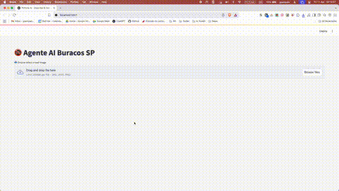

# City AI Agent

City AI Agent is an end‑to‑end municipal infrastructure intelligence platform that detects, analyzes, and summarizes road hazards—specifically potholes—for city maintenance teams. Leveraging state‑of‑the‑art computer vision, geospatial data, and local large language model inference, this tool empowers cities with actionable, context‑rich insights in Brazilian Portuguese.



---

## 🚀 Key Features

- **Real‑Time Pothole Detection:**  
  Utilizes a custom‑trained YOLOv8 model for on‑the‑fly detection of potholes from road images.
  
- **Geospatial Enrichment:**  
  Integrates with public geocoding (Nominatim) and Overpass APIs to extract location data, nearby amenities, and critical infrastructure information.
  
- **Multimodal AI Summarization:**  
  Uses LLaMA via Ollama for generating clean, context‑aware summaries. The optional captioning module can supply supplementary visual context but is no longer required.
  
- **Interactive UI:**  
  Built in Streamlit and enhanced with Folium maps, the interface presents detection results, geospatial data, and AI‑generated summaries in clear, step‑wise panels.

- **Modular, Scalable Architecture:**  
  Business logic is fully separated into dedicated service modules so that the presentation layer remains 100% UI‑focused.

---

## 📂 Project Structure

```bash
.
├── models
│   └── Baseline_YOLOv8Small_Filtered.pt    # Pre‑trained YOLOv8 model for pothole detection
├── README.md                               # This file
├── requirements.txt                        # Python dependencies
└── src
    ├── config.py                           # Application configuration and secrets
    ├── main.py                             # Main Streamlit application
    └── services
        ├── captioning.py                   # (Optional) Image captioning using BLIP
        ├── detection.py                    # YOLO‑based pothole detection logic
        ├── geo.py                       # Geocoding & Overpass API integrations
        └── llm.py                       # LLaMA integration for AI insight & summary generation
```

---

## 🧠 AI Stack Overview

### YOLOv8 Detection

- **Function:** Locates potholes and computes severity based on bounding box metrics.
- **Usage:** The detection service processes uploaded road images and annotates pothole locations.

### LLM Summarization with LLaMA via Ollama

- **Models:**
  - `llama3.2:3b` for text‑only summary generation.
  - `llama3.2-vision` for multimodal insights when required.
- **How It Works:**  
  Combines geospatial data, visual detection results, and (optionally) image captions (if provided) to generate concise, context‑rich summaries in 100% BR‑Portuguese.
- **Note:** Captioning is now optional, allowing a more streamlined workflow if desired.

## 🌐 API Integrations Overview

City AI Agent relies on three powerful, open-access APIs that make up the geospatial intelligence layer:

### 1. OpenStreetMap (OSM)

- **What it is:**  
  A collaborative, open-source map of the world, built by a community of mappers that contribute and maintain data about roads, buildings, infrastructure, and more.
  
- **Usage in this project:**  
  - OSM provides the base data used by both the Nominatim and Overpass APIs.
  - All geospatial queries and results are ultimately derived from OSM data.
  - OSM’s structure allows for rich metadata tagging (e.g., surface type, max speed, amenity types) that is leveraged in road analysis.

> 🌐 Website: https://www.openstreetmap.org/

### 2. Nominatim API

- **What it is:**  
  A geocoding and reverse geocoding service that uses OpenStreetMap data.

- **Endpoints used:**
  - **Forward geocoding:** Convert textual addresses to latitude/longitude.
  - **Reverse geocoding:** Convert coordinates into human-readable addresses and context.

- **Example in City AI Agent:**
  - Identify the exact address or road name where a pothole is located.
  - Determine neighborhood or administrative boundaries for reporting.

```python
# Example use (from geo.py):
lat, lon, display_name = forward_geocode("Av. Paulista, São Paulo, Brazil")
```

> 📘 API Docs: https://nominatim.org/release-docs/latest/api/Overview/

### 3. Overpass API

- **What it is:**  
  A query API that allows custom searches against the OpenStreetMap dataset using Overpass QL (query language).

- **Used for:**
  - Searching for amenities (schools, hospitals, etc.) near detected potholes.
  - Analyzing infrastructure metadata like road types, surface quality, number of lanes, and speed limits.
  - Filtering specific tags (e.g., "highway", "amenity", "surface") in a geographic radius.

- **Example in City AI Agent:**
  - Fetch traffic-related attributes for nearby roads.
  - Visualize surrounding context for hazard prioritization.

```overpassql
[out:json];
way(around:100, -23.561, -46.656)["highway"];
out body;
```

> 📓 API Docs: https://overpass-api.de/

### Optional BLIP Captioning

- **Function:** Generates image captions to complement detection data.
- **Status:** Available as a service module but no longer mandatory within the AI pipeline.

---

## 💻 User Interface

- **Framework:** Streamlit  
  The UI orchestrates the processing steps—image upload, detection, geospatial enrichment, and AI summarization—while business logic is abstracted in the `services/` modules.
- **Mapping:** Folium is used to visualize pothole locations and nearby facilities on an interactive map.

---

## 🧠 Model & Dataset Provenance

### YOLOv8 Base: Road Damage Detection Applications

The YOLOv8 model used in this project was trained using the open-source initiative [Road Damage Detection Applications](https://github.com/oracl4/RoadDamageDetection), designed to detect various types of road surface issues.

- **Model Type:** YOLOv8s
- **Dataset:** Crowdsensing-based Road Damage Detection Challenge 2022 (CRDDC2022)
- **Damage Types Detected:**
  - Longitudinal Crack
  - Transverse Crack
  - Alligator Crack
  - Potholes

### Dataset Processing

- Subset used: Filtered data from **Japan** and **India**
- Converted to YOLOv8 format
- Training and evaluation performed on local machine with RTX2060 GPU

---

## 🛠️ Requirements

Install the required dependencies using:

```bash
pip install -r requirements.txt
```

Key libraries include:

- `streamlit`
- `ultralytics`
- `torch`
- `transformers`
- `folium`
- `Pillow`
- `geopy`
- `opencv-python`
- `requests`
- `ollama` (for offline LLM integration)

---

## 🚀 Running the App

### Image-Based Triage

Ensure that you have a YOLOv8‑compatible model at `./models/Baseline_YOLOv8Small_Filtered.pt` and then run:

```bash
streamlit run src/main.py
```

---

## 📈 Extending the Project

- **Service Modules:**  
  Easily extend or replace components by editing the services under `src/services/`. Each module (detection, geo, llm, captioning) encapsulates a specific domain logic.
  
- **Configuration:**  
  Update runtime parameters and API keys in `src/config.py`.

- **Optional Training:**  
  Although not included here, you can train custom YOLO models using your preferred notebooks and datasets.

---

## 📣 Credits

- **Detection:** [Ultralytics YOLOv8](https://github.com/ultralytics/ultralytics)
- **Dataset & Base Model:** [Road Damage Detection Applications](https://github.com/oracl4/RoadDamageDetection)
- **Geospatial APIs:** [OpenStreetMap](https://www.openstreetmap.org/), [Nominatim](https://nominatim.openstreetmap.org/), [Overpass API](https://overpass-api.de/)
- **LLM Integration:** [Ollama LLaMA3](https://ollama.com)
